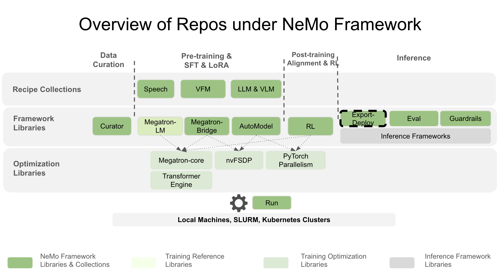

<div align="center">

# NeMo Export-Deploy

</div>

<div align="center">

<!-- [](https://opensource.org/licenses/Apache-2.0) -->
[](https://codecov.io/github/NVIDIA-NeMo/Export-Deploy)
[](https://github.com/NVIDIA-NeMo/Export-Deploy/actions/workflows/cicd-main.yml)
[](https://www.python.org/downloads/release/python-3100/)
[](https://github.com/NVIDIA-NeMo/Export-Deploy/stargazers/)

<!-- **Library with tooling and APIs for exporting and deploying NeMo and Hugging Face models with support of backends like  TensorRT, TensorRT-LLM and vLLM through NVIDIA Triton Inference Server.** -->

[](https://docs.nvidia.com/nemo/export-deploy/latest/index.html)
[](https://github.com/NVIDIA-NeMo/Export-Deploy?tab=readme-ov-file#-install)
[](https://github.com/NVIDIA-NeMo/Export-Deploy?tab=readme-ov-file#-get-started-quickly)
[](https://github.com/NVIDIA-NeMo/Export-Deploy/blob/main/CONTRIBUTING.md)

</div>

The **Export-Deploy library ("NeMo Export-Deploy")** provides tools and APIs for exporting and deploying NeMo and 🤗Hugging Face models to production environments. It supports various deployment paths including TensorRT, TensorRT-LLM, and vLLM deployment through NVIDIA Triton Inference Server and Ray Serve.



## 🚀 Key Features

- Support for Large Language Models (LLMs) and Multimodal Models (MMs)
- Export NeMo and Hugging Face models to optimized inference formats including TensorRT-LLM and vLLM
- Deploy NeMo and Hugging Face models using Ray Serve or NVIDIA Triton Inference Server
- Export quantized NeMo models (FP8, etc)
- Multi-GPU and distributed inference capabilities
- Multi-instance deployment options

## Feature Support Matrix

### Model Export Capabilities

| Model / Checkpoint                                                                              | TensorRT-LLM                                   | vLLM      | ONNX                        | TensorRT               |
|-------------------------------------------------------------------------------------------------|:----------------------------------------------:|:---------:|:--------------------------:|:----------------------:|
| [Megatron-LM](https://github.com/NVIDIA/Megatron-LM)                                            | Coming Soon                                    | Coming Soon | N/A                      | N/A                    |
| [Hugging Face](https://huggingface.co/docs/transformers/en/index)                               | bf16                                           | bf16      | N/A                      | N/A                    |
| [NIM Embedding](https://docs.nvidia.com/nim/nemo-retriever/text-embedding/latest/overview.html) | N/A                                            | N/A       | bf16, fp8, int8 (PTQ)      | bf16, fp8, int8 (PTQ)  |
| [NIM Reranking](https://docs.nvidia.com/nim/nemo-retriever/text-reranking/latest/overview.html) | N/A                                            | N/A       | Coming Soon                | Coming Soon            |

The support matrix above outlines the export capabilities for each model or checkpoint, including the supported precision options across various inference-optimized libraries. The export module enables exporting models that have been quantized using post-training quantization (PTQ) with the [TensorRT Model Optimizer](https://github.com/NVIDIA/TensorRT-Model-Optimizer) library, as shown above. Models trained with low precision or quantization-aware training are also supported, as indicated in the table.

The inference-optimized libraries listed above also support on-the-fly quantization during model export, with configurable parameters available in the export APIs. However, please note that the precision options shown in the table above indicate support for exporting models that have already been quantized, rather than the ability to quantize models during export.

Please note that not all large language models (LLMs) and multimodal models (MMs) are currently supported. For the most complete and up-to-date information, please refer to the [LLM documentation](https://docs.nvidia.com/nemo/export-deploy/latest/llm/index.html) and [MM documentation](https://docs.nvidia.com/nemo/export-deploy/latest/mm/index.html).

### Model Deployment Capabilities

| Model / Checkpoint                                                                        | RayServe                                 | PyTriton                |
|-------------------------------------------------------------------------------------------|------------------------------------------|-------------------------|
| [Megatron-LM](https://github.com/NVIDIA/Megatron-LM)                                      | Coming Soon                              | Coming Soon             |
| [Hugging Face](https://huggingface.co/docs/transformers/en/index)                         | Single-Node Multi-GPU,<br>Multi-instance | Single-Node Multi-GPU   |
| [TensorRT-LLM](https://github.com/NVIDIA/TensorRT-LLM)                                    | Single-Node Multi-GPU,<br>Multi-instance | Multi-Node Multi-GPU    |
| [vLLM](https://github.com/vllm-project/vllm)                                              | N/A                                      | Single-Node Multi-GPU   |

The support matrix above outlines the available deployment options for each model or checkpoint, highlighting multi-node and multi-GPU support where applicable. For comprehensive details, please refer to the [documentation](https://docs.nvidia.com/nemo/export-deploy/latest/index.html).

Refer to the table below for an overview of optimized inference and deployment support for NeMo Framework and Hugging Face models with Triton Inference Server.

| Model / Checkpoint           | TensorRT-LLM + Triton Inference Server | vLLM + Triton Inference Server | Direct Triton Inference Server |
|------------------------------|:--------------------------------------:|:------------------------------:|:------------------------------:|
| Hugging Face                 | &#x2611;                              | &#x2611;                      | &#x2611;                      |

## 🔧 Install

For quick exploration of NeMo Export-Deploy, we recommend installing our pip package:

```bash
pip install nemo-export-deploy
```

This installation comes without extra dependencies like [TransformerEngine](https://github.com/NVIDIA/TransformerEngine/), [TensorRT-LLM](https://github.com/NVIDIA/TensorRT-LLM) or [vLLM](https://github.com/vllm-project/vllm). The installation serves for navigating around and for exploring the project.

For a feature-complete install, please refer to the following sections.

### Use NeMo-FW Container

Best experience, highest performance and full feature support is guaranteed by the [NeMo Framework container](https://catalog.ngc.nvidia.com/orgs/nvidia/containers/nemo/tags). Please fetch the most recent `$TAG` and run the following command to start a container:

```bash
docker run --rm -it -w /workdir -v $(pwd):/workdir \
  --entrypoint bash \
  --gpus all \
  nvcr.io/nvidia/nemo:${TAG}
```

### Build with Dockerfile

For containerized development, use our Dockerfile for building your own container. There are three flavors: `INFERENCE_FRAMEWORK=inframework`, `INFERENCE_FRAMEWORK=trtllm` and `INFERENCE_FRAMEWORK=vllm`:

```bash
docker build \
    -f docker/Dockerfile.pytorch \
    -t nemo-export-deploy \
    --build-arg INFERENCE_FRAMEWORK=$INFERENCE_FRAMEWORK \
    .
```

Start your container:

```bash
docker run --rm -it -w /workdir -v $(pwd):/workdir \
  --entrypoint bash \
  --gpus all \
  nemo-export-deploy
```

### Install from Source

For complete feature coverage, we recommend to install [TransformerEngine](https://github.com/NVIDIA/TransformerEngine/?tab=readme-ov-file#pip-installation) and additionally either [TensorRT-LLM](https://nvidia.github.io/TensorRT-LLM/0.20.0/installation/linux.html) or [vLLM](https://docs.vllm.ai/en/latest/getting_started/installation/gpu.html#pre-built-wheels).

#### Recommended Requirements

- Python 3.12
- PyTorch 2.7
- CUDA 12.9
- Ubuntu 24.04

#### Install TransformerEngine + InFramework

For highly optimized TransformerEngine path with PyTriton backend, please make sure to install the following prerequisites first:

```bash
pip install torch==2.7.0 setuptools pybind11 wheel_stub  # Required for TE
```

Now proceed with the main installation:

```bash
git clone https://github.com/NVIDIA-NeMo/Export-Deploy
cd Export-Deploy/
pip install --no-build-isolation .
```

#### Install TransformerEngine + TensorRT-LLM

For highly optimized TransformerEngine path with TensorRT-LLM backend, please make sure to install the following prerequisites first:

```bash
sudo apt-get -y install libopenmpi-dev  # Required for TensorRT-LLM
pip install torch==2.7.0 setuptools pybind11 wheel_stub  # Required for TE
```

Now proceed with the main installation:

```bash
pip install --no-build-isolation .[trtllm]
```

#### Install TransformerEngine + vLLM

For highly optimized TransformerEngine path with vLLM backend, please make sure to install the following prerequisites first:

```bash
pip install torch==2.7.0 setuptools pybind11 wheel_stub  # Required for TE
```

Now proceed with the main installation:

```bash
pip install --no-build-isolation .[vllm]
```

#### Install TransformerEngine + TRT-ONNX

For highly optimized TransformerEngine path with TRT-ONNX backend, please make sure to install the following prerequisites first:

```bash
pip install torch==2.7.0 setuptools pybind11 wheel_stub  # Required for TE
```

Now proceed with the main installation:

```bash
pip install --no-build-isolation .[trt-onnx]
```


## 🤝 Contributing

We welcome contributions to NeMo Export-Deploy! Please see our [Contributing Guidelines](https://github.com/NVIDIA-NeMo/Export-Deploy/blob/main/CONTRIBUTING.md) for more information on how to get involved.

## License

NeMo Export-Deploy is licensed under the [Apache License 2.0](https://github.com/NVIDIA-NeMo/Export-Deploy?tab=Apache-2.0-1-ov-file).
